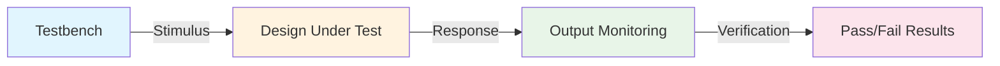
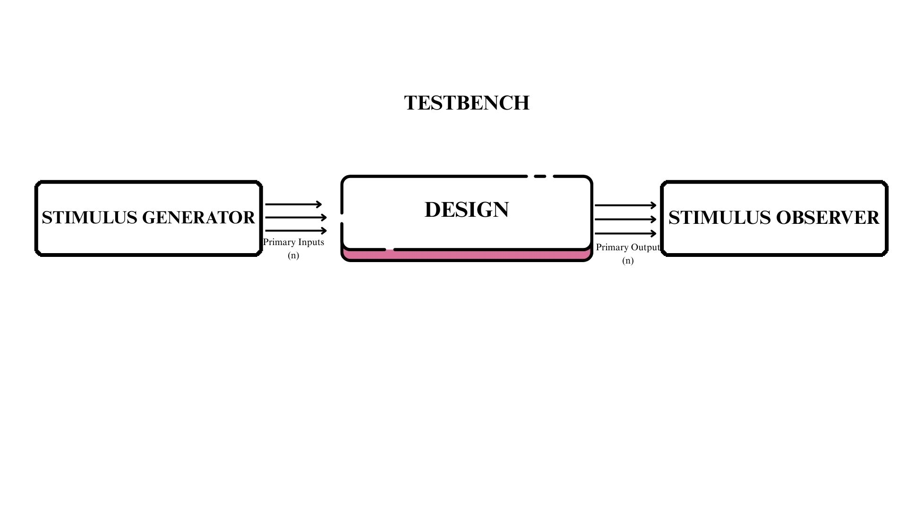
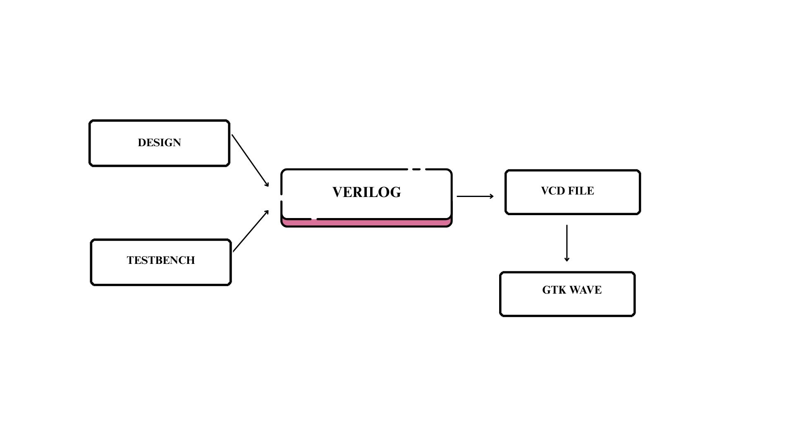

# Day 1: Introduction to Verilog RTL Design and Synthesis

<div align="center">


</div>

## 📋 Table of Contents

- [Overview](#-overview)
- [Learning Objectives](#-learning-objectives)
- [Topics Covered](#-topics-covered)
  - [1. Introduction to Open Source Simulator - Iverilog](#1-introduction-to-open-source-simulator---iverilog)
  - [2. Labs using Iverilog and GTKWave](#2-labs-using-iverilog-and-gtkwave)
  - [3. Introduction to Yosys and Logic Synthesis](#3-introduction-to-yosys-and-logic-synthesis)
  - [4. Labs using Yosys and Sky130 PDKs](#4-labs-using-yosys-and-sky130-pdks)

---

## 🎯 Overview

Day 1 introduces the fundamental concepts of RTL design and synthesis, focusing on understanding the digital design flow from RTL to gate-level implementation. This session covers essential tools in the open-source EDA ecosystem and establishes the foundation for advanced topics in subsequent days.

## 🎓 Learning Objectives

By the end of Day 1, you will understand:
- ✅ Core concepts of simulators, design, and testbenches
- ✅ How simulators work and their event-driven nature
- ✅ Iverilog simulation flow and GTKWave visualization
- ✅ Logic synthesis principles and Yosys tool usage
- ✅ Integration of simulation and synthesis in design flow

---

## 📚 Topics Covered

### 1. Introduction to Open Source Simulator - Iverilog

<div align="center">
  
  
  
</div>

#### 🔍 Fundamental Concepts

<table>
<tr>
<td width="50%">

**🎯 What is a Simulator?**

A **simulator** is a crucial tool in the digital design verification process:

- 🔍 **Primary Purpose**: Tool to check the design (RTL design)
- ✅ **Verification Role**: Confirms functionality by applying test scenarios  
- 🛠️ **Tool of Choice**: **Iverilog** - our open-source simulator
- 📈 **Industry Standard**: Essential for design validation before synthesis

> *"Simulation is the process of imitating the operation of a real-world system over time"*

</td>
<td width="50%">

**💡 What is a Design?**

The **design** represents the core digital logic implementation:

- 📝 **Definition**: Actual Verilog code or set of Verilog files
- 🎪 **Purpose**: Contains intended functionality meeting required specs
- 🏗️ **Abstraction**: RTL (Register Transfer Level) circuit description
- 🎯 **Goal**: Describes WHAT the circuit should do, not HOW to build it

</td>
</tr>
</table>

---

#### 🧪 What is a Testbench?

<div align="center">
  


</div>

**Testbench Characteristics:**
- 🎭 **Role**: Acts as a "virtual laboratory" for testing designs
- 🔬 **Function**: Applies stimulus (test vectors) to Design Under Test (DUT)
- 📊 **Monitoring**: Captures and analyzes responses for verification
- 🎪 **Environment**: Creates controlled testing scenarios

---

#### ⚙️ How Simulator Works - The Magic Behind The Scenes

<div align="center">

```ascii
┌─────────────────────────────────────────────────────────────────┐
│                    🔄 SIMULATOR OPERATION FLOW                    │
└─────────────────────────────────────────────────────────────────┘

    📥 INPUT CHANGE DETECTED
           │
           ▼
    🧠 EVENT SCHEDULING
           │
           ▼
    ⚡ OUTPUT EVALUATION
           │
           ▼
    📊 RESULT UPDATE
           │
           ▼
    🔄 WAIT FOR NEXT CHANGE
```

</div>

**🎯 Core Operating Principles:**

<table>
<tr>
<td align="center" width="33%">

**🎪 Event-Driven Nature**
```
Input Change → Output Evaluation
```
Based on input changes, outputs are computed

</td>
<td align="center" width="33%">

**⚖️ The Golden Rule**
```
No Input Change = No Output Change
```
Simulator conserves computational resources

</td>
<td align="center" width="33%">

**👀 Change Detection**
```
Continuous Input Monitoring
```
Simulator watches for value transitions

</td>
</tr>
</table>

**📋 Detailed Working Mechanism:**

1. **🔍 Input Monitoring**: Simulator continuously monitors all input signals
2. **📅 Event Scheduling**: When input changes, events are scheduled in time queue
3. **⚡ Evaluation**: Affected logic blocks are re-evaluated
4. **📊 Update**: Outputs are updated based on new input values
5. **🔄 Iteration**: Process repeats for next input change

<p align="center">
  
</p>

> **Suggested Content**: 
> - Input change detection mechanism
> - Event queue management
> - Output evaluation process
> - Time advancement logic

---


**🧠 Key Insights:**
- **Event E1**: Input A changes → Output Y evaluates
- **Event E2**: Input A changes → Output Y evaluates  
- **Event E3**: Input B changes → Output Y evaluates
- **Event E4**: Input B changes → Output Y evaluates
- **Event E5**: Input A changes → Output Y evaluates

---

#### 🏆 Why Iverilog?

<div align="center">

<table>
<tr>
<td align="center">

**🆓 Open Source**
- Free to use
- Community driven
- Transparent development

</td>
<td align="center">

**⚡ Fast Simulation**
- Efficient algorithms
- Optimized performance
- Quick compilation

</td>
<td align="center">

**🔧 Easy Integration**
- Command line interface
- Scriptable workflows
- Tool chain compatibility

</td>
</tr>
</table>

</div>

**🎯 Iverilog Advantages:**
- ✅ **Standards Compliant**: Supports IEEE 1364 Verilog standards
- ✅ **Cross Platform**: Works on Linux, Windows, macOS
- ✅ **Extensive Support**: Handles complex Verilog constructs
- ✅ **Active Development**: Regular updates and bug fixes
- ✅ **Educational Friendly**: Perfect for learning digital design

<p align="center">
  
</p>


---

### 2. Labs using Iverilog and GTKWave

*[Content to be added as per your next requirements]*

---

### 3. Introduction to Yosys and Logic Synthesis

*[Content to be added as per your next requirements]*

---

### 4. Labs using Yosys and Sky130 PDKs

*[Content to be added as per your next requirements]*

---

## 📁 File Structure

```
Day1/
├── README.md                    # This documentation
├── images/                      # Screenshots and diagrams
├── verilog_files/              # RTL design files
├── testbenches/                # Verification files
├── synthesis_results/          # Yosys outputs
└── scripts/                    # Automation scripts
```

---

## 🔗 Quick Navigation

- [⬅️ Back to Week 1 Overview](../README.md)
- [➡️ Continue to Day 2](../Day2/taskM.md)

---

<div align="center">

**📚 Day 1 - Section 1 Complete!**  
*Introduction to Open Source Simulator - Iverilog*

**Next**: Continue with remaining sections as per requirements

</div>
