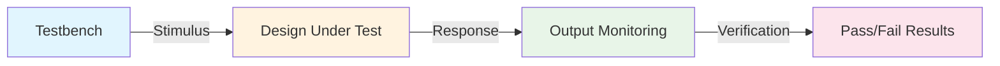
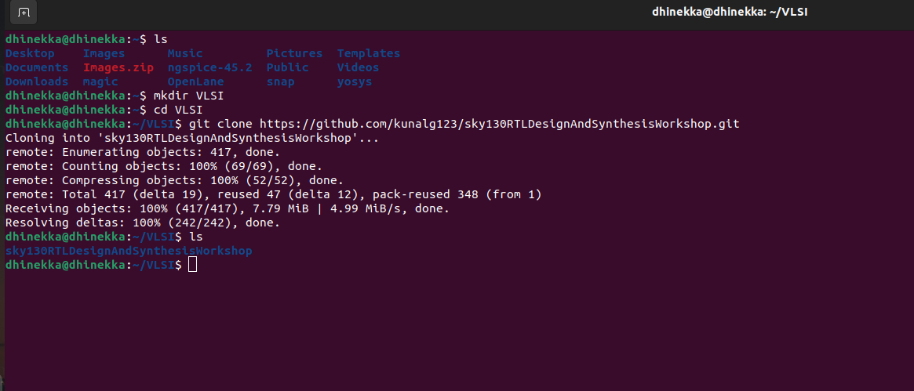
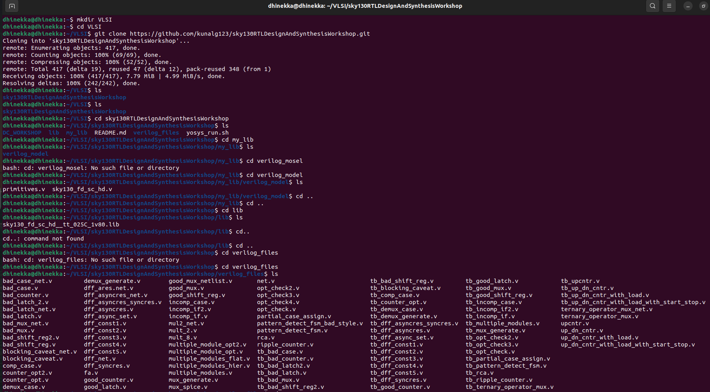
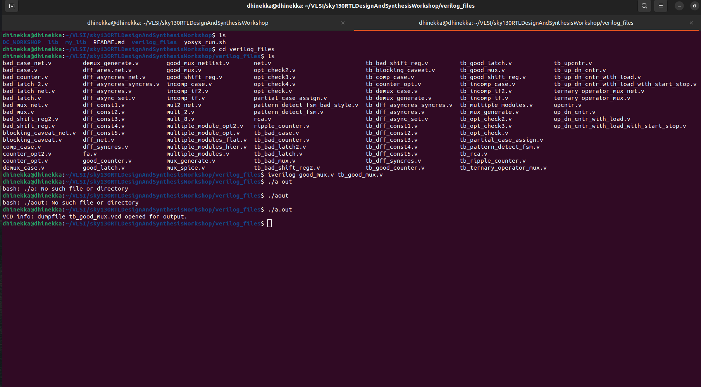
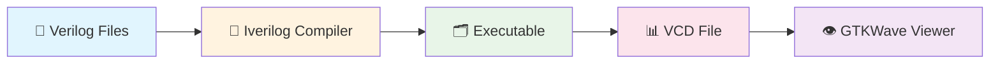
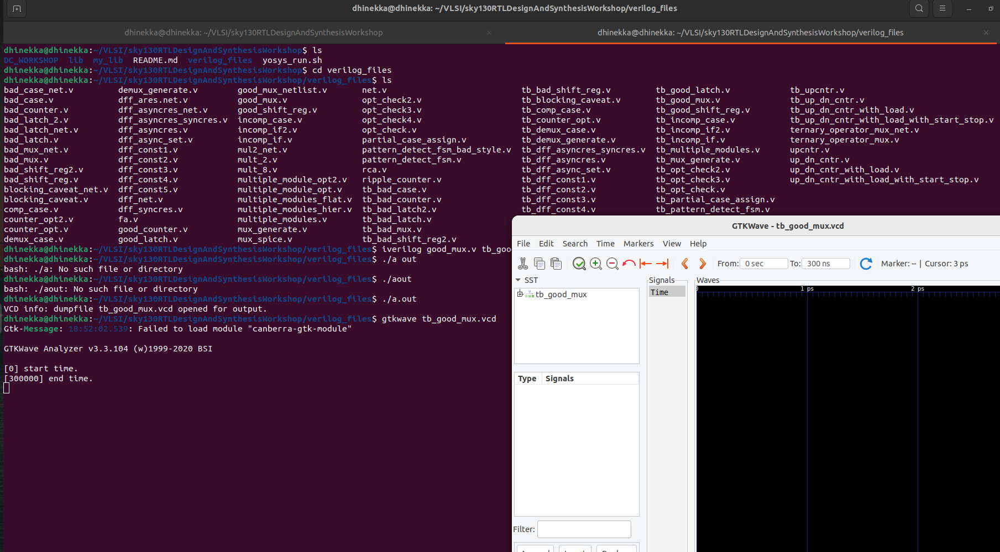
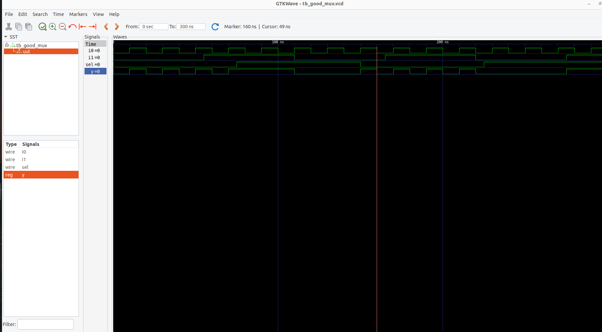
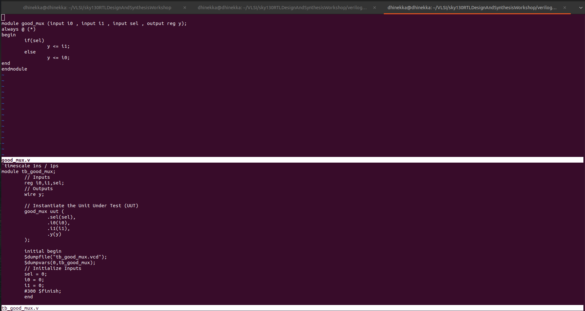

# Day 1: Introduction to Verilog RTL Design and Synthesis

<div align="center">


</div>

## 📋 Table of Contents

- [Overview](#-overview)
- [Learning Objectives](#-learning-objectives)
- [Topics Covered](#-topics-covered)
  - [1. Introduction to Open Source Simulator - Iverilog](#1-introduction-to-open-source-simulator---iverilog)
  - [2. Labs using Iverilog and GTKWave](#2-labs-using-iverilog-and-gtkwave)
  - [3. Introduction to Yosys and Logic Synthesis](#3-introduction-to-yosys-and-logic-synthesis)
  - [4. Labs using Yosys and Sky130 PDKs](#4-labs-using-yosys-and-sky130-pdks)

---

## 🎯 Overview

Day 1 introduces the fundamental concepts of RTL design and synthesis, focusing on understanding the digital design flow from RTL to gate-level implementation. This session covers essential tools in the open-source EDA ecosystem and establishes the foundation for advanced topics in subsequent days.

## 🎓 Learning Objectives

By the end of Day 1, you will understand:
- ✅ Core concepts of simulators, design, and testbenches
- ✅ How simulators work and their event-driven nature
- ✅ Iverilog simulation flow and GTKWave visualization
- ✅ Logic synthesis principles and Yosys tool usage
- ✅ Integration of simulation and synthesis in design flow

---

## 📚 Topics Covered

### 1. Introduction to Open Source Simulator - Iverilog

<div align="center">
  
  
  
</div>

#### 🔍 Fundamental Concepts

<table>
<tr>
<td width="50%">

**🎯 What is a Simulator?**

A **simulator** is a crucial tool in the digital design verification process:

- 🔍 **Primary Purpose**: Tool to check the design (RTL design)
- ✅ **Verification Role**: Confirms functionality by applying test scenarios  
- 🛠️ **Tool of Choice**: **Iverilog** - our open-source simulator
- 📈 **Industry Standard**: Essential for design validation before synthesis

> *"Simulation is the process of imitating the operation of a real-world system over time"*

</td>
<td width="50%">

**💡 What is a Design?**

The **design** represents the core digital logic implementation:

- 📝 **Definition**: Actual Verilog code or set of Verilog files
- 🎪 **Purpose**: Contains intended functionality meeting required specs
- 🏗️ **Abstraction**: RTL (Register Transfer Level) circuit description
- 🎯 **Goal**: Describes WHAT the circuit should do, not HOW to build it

</td>
</tr>
</table>

---

#### 🧪 What is a Testbench?

<div align="center">
  


</div>

**Testbench Characteristics:**
- 🎭 **Role**: Acts as a "virtual laboratory" for testing designs
- 🔬 **Function**: Applies stimulus (test vectors) to Design Under Test (DUT)
- 📊 **Monitoring**: Captures and analyzes responses for verification
- 🎪 **Environment**: Creates controlled testing scenarios

---

#### ⚙️ How Simulator Works - The Magic Behind The Scenes

<div align="center">

```ascii
┌─────────────────────────────────────────────────────────────────┐
│                    🔄 SIMULATOR OPERATION FLOW                    │
└─────────────────────────────────────────────────────────────────┘

    📥 INPUT CHANGE DETECTED
           │
           ▼
    🧠 EVENT SCHEDULING
           │
           ▼
    ⚡ OUTPUT EVALUATION
           │
           ▼
    📊 RESULT UPDATE
           │
           ▼
    🔄 WAIT FOR NEXT CHANGE
```

</div>

**🎯 Core Operating Principles:**

<table>
<tr>
<td align="center" width="33%">

**🎪 Event-Driven Nature**
```
Input Change → Output Evaluation
```
Based on input changes, outputs are computed

</td>
<td align="center" width="33%">

**⚖️ The Golden Rule**
```
No Input Change = No Output Change
```
Simulator conserves computational resources

</td>
<td align="center" width="33%">

**👀 Change Detection**
```
Continuous Input Monitoring
```
Simulator watches for value transitions

</td>
</tr>
</table>

**📋 Detailed Working Mechanism:**

1. **🔍 Input Monitoring**: Simulator continuously monitors all input signals
2. **📅 Event Scheduling**: When input changes, events are scheduled in time queue
3. **⚡ Evaluation**: Affected logic blocks are re-evaluated
4. **📊 Update**: Outputs are updated based on new input values
5. **🔄 Iteration**: Process repeats for next input change

<p align="center">
  
</p>

> **Suggested Content**: 
> - Input change detection mechanism
> - Event queue management
> - Output evaluation process
> - Time advancement logic

---


**🧠 Key Insights:**
- **Event E1**: Input A changes → Output Y evaluates
- **Event E2**: Input A changes → Output Y evaluates  
- **Event E3**: Input B changes → Output Y evaluates
- **Event E4**: Input B changes → Output Y evaluates
- **Event E5**: Input A changes → Output Y evaluates

---

#### 🏆 Why Iverilog?

<div align="center">

<table>
<tr>
<td align="center">

**🆓 Open Source**
- Free to use
- Community driven
- Transparent development

</td>
<td align="center">

**⚡ Fast Simulation**
- Efficient algorithms
- Optimized performance
- Quick compilation

</td>
<td align="center">

**🔧 Easy Integration**
- Command line interface
- Scriptable workflows
- Tool chain compatibility

</td>
</tr>
</table>

</div>

**🎯 Iverilog Advantages:**
- ✅ **Standards Compliant**: Supports IEEE 1364 Verilog standards
- ✅ **Cross Platform**: Works on Linux, Windows, macOS
- ✅ **Extensive Support**: Handles complex Verilog constructs
- ✅ **Active Development**: Regular updates and bug fixes
- ✅ **Educational Friendly**: Perfect for learning digital design

<p align="center">
  
</p>


---

### 2. Labs using Iverilog and GTKWave

<div align="center">
  
  
  
</div>

#### 🚀 Lab Environment Setup

This section demonstrates the complete hands-on simulation flow using open-source tools. We'll walk through the entire process from cloning the workshop repository to analyzing waveforms in GTKWave.

---

#### 📂 Workshop Repository Setup

**🎯 Setting up the Lab Environment:**

The first step involves cloning the sky130RTLDesignAndSynthesisWorkshop repository which contains all the necessary Verilog files, libraries, and examples for our learning journey.

<table>
<tr>
<td width="50%">

**📋 Repository Cloning Process:**

```bash
# Navigate to desired directory
mkdir VLSI
cd VLSI

# Clone the workshop repository  
git clone https://github.com/kunalg123/sky130RTLDesignAndSynthesisWorkshop.git

# Navigate to the cloned directory
cd sky130RTLDesignAndSynthesisWorkshop
```

</td>
<td width="50%">

**📁 Repository Structure Analysis:**

The cloned repository contains:
- 📝 **verilog_files/**: RTL design files and testbenches
- 📚 **my_lib/**: Technology libraries and cell information  
- 🔧 **lib/**: Timing libraries for synthesis
- 📊 Various example designs for learning

</td>
</tr>
</table>

> 📸 **[LAB IMAGE 1 - Repository Setup]**  



---

#### 🗂️ Exploring the Directory Structure

**🔍 Understanding the Workshop Organization:**

<div align="center">

```ascii
sky130RTLDesignAndSynthesisWorkshop/
├── 📁 dc_workshop/           # Design Compiler related files
├── 📁 lib/                  # Timing libraries (.lib files)
├── 📁 my_lib/               # Technology specific libraries
│   ├── 📁 lib/             # Liberty format libraries
│   └── 📁 verilog_model/   # Verilog models of standard cells
├── 📁 verilog_files/        # 🎯 Main focus: RTL designs & testbenches
└── 📄 yosys_run.sh          # Synthesis automation script
```

</div>

**📋 Key Directory Analysis:**

| Directory | Purpose | Key Files |
|-----------|---------|-----------|
| **📁 verilog_files/** | RTL designs and testbenches | `*.v` files for simulation |
| **📁 my_lib/lib/** | Standard cell libraries | Sky130 `.lib` files |
| **📁 my_lib/verilog_model/** | Cell models | Behavioral models for simulation |

> 📸 **[LAB IMAGE 2 - Directory Exploration]**  



---

#### 🧪 First Simulation Lab - Good Mux Design

**🎯 Objective:** Understand the complete Iverilog simulation flow using a 2:1 multiplexer example.

##### 📝 Design Analysis

Let's examine the `good_mux.v` design file:

<table>
<tr>
<td width="50%">

**🔍 Design Code Structure:**
```verilog
module good_mux (
    input i0, 
    input i1, 
    input sel, 
    output reg y
);

always @(*) begin
    if(sel)
        y <= i1;
    else
        y <= i0;
end

endmodule
```

</td>
<td width="50%">

**📊 Design Characteristics:**
- **Type**: 2:1 Multiplexer
- **Inputs**: `i0`, `i1` (data), `sel` (select)
- **Output**: `y` (selected data)
- **Logic**: Combinational using `always @(*)`
- **Coding Style**: Good RTL practices

</td>
</tr>
</table>

##### 🧪 Testbench Analysis

The corresponding testbench `tb_good_mux.v`:

<table>
<tr>
<td width="50%">

**🔬 Testbench Structure:**
```verilog
module tb_good_mux;
    // Inputs
    reg i0, i1, sel;
    // Outputs  
    wire y;
    
    // Instantiate UUT
    good_mux uut (
        .sel(sel),
        .i0(i0),
        .i1(i1),
        .y(y)
    );
    
    initial begin
        $dumpfile("tb_good_mux.vcd");
        $dumpvars(0,tb_good_mux);
        // Test vectors...
    end
endmodule
```

</td>
<td width="50%">

**🎯 Testbench Features:**
- **Stimulus Generation**: Systematic input patterns
- **VCD Dumping**: Waveform capture for GTKWave
- **Coverage**: All possible input combinations
- **Timing**: Proper delays between test vectors

</td>
</tr>
</table>

> 📸 **[LAB IMAGE 3 - Design and Testbench Files]**  



---

#### ⚡ Iverilog Simulation Process

**🔄 Complete Simulation Flow:**

<div align="center">



</div>

##### 🚀 Step-by-Step Simulation Commands

<table>
<tr>
<td width="50%">

**1️⃣ Compilation Phase:**
```bash
# Navigate to verilog_files directory
cd verilog_files

# Compile design + testbench
iverilog good_mux.v tb_good_mux.v

# This creates 'a.out' executable
ls -la a.out
```

</td>
<td width="50%">

**2️⃣ Simulation Execution:**
```bash
# Run the simulation
./a.out

# This generates tb_good_mux.vcd
ls -la *.vcd

# Verify VCD file creation
file tb_good_mux.vcd
```

</td>
</tr>
</table>

**📋 Command Explanation:**

| Command | Purpose | Output |
|---------|---------|---------|
| `iverilog good_mux.v tb_good_mux.v` | Compiles Verilog files | Creates `a.out` executable |
| `./a.out` | Runs simulation | Generates `tb_good_mux.vcd` file |
| VCD creation | Captures all signal transitions | Ready for waveform viewing |

> 📸 **[LAB IMAGE 4 - Simulation Commands]**  



---

#### 📊 GTKWave Waveform Analysis

**🎯 Launching GTKWave and Loading Waveforms:**

##### 🚀 GTKWave Startup Process

<table>
<tr>
<td width="50%">

**📱 GTKWave Launch:**
```bash
# Open VCD file in GTKWave
gtkwave tb_good_mux.vcd

# Alternative: Background execution
gtkwave tb_good_mux.vcd &
```

**⚙️ GTKWave Interface Elements:**
- **SST Panel**: Signal Source Tree
- **Waves Window**: Waveform display area  
- **Time Ruler**: Timeline with markers
- **Signal List**: Selected signals panel

</td>
<td width="50%">

**🔍 Waveform Loading Steps:**
1. **Select Signals**: From SST tree on left
2. **Add to Waves**: Drag or double-click signals
3. **Adjust Timebase**: Zoom and pan controls
4. **Analyze Behavior**: Verify design functionality

**🎨 Visual Analysis Features:**
- Color-coded signal traces
- Cursor measurements  
- Signal value annotations
- Time markers and rulers

</td>
</tr>
</table>

> 📸 **[LAB IMAGE 5 - GTKWave Interface]**  



---

#### 🔍 Detailed Waveform Analysis

**📈 Signal Behavior Verification:**

The GTKWave analysis reveals the complete functionality of our 2:1 multiplexer:

<table>
<tr>
<td width="50%">

**🎯 Key Observations:**

**Signal Transitions:**
- **`sel`**: Controls output selection
- **`i0`, `i1`**: Input data signals  
- **`y`**: Output following mux logic

**Functional Verification:**
- When `sel = 0` → `y = i0`
- When `sel = 1` → `y = i1`
- Clean switching behavior
- No glitches or undefined states

</td>
<td width="50%">

**📊 Timing Analysis:**

**Critical Aspects:**
- **Propagation Delay**: Input to output delay
- **Setup/Hold Times**: Input stability requirements
- **Glitch-Free Operation**: Clean signal transitions
- **Complete Coverage**: All input combinations tested

**🎪 Design Quality Metrics:**
✅ Functional correctness verified  
✅ No timing violations observed  
✅ Clean waveform transitions  
✅ Complete test coverage achieved

</td>
</tr>
</table>

> 📸 **[LAB IMAGE 6 - Complete Waveform Analysis]**  



---

#### 🎯 Lab Learning Outcomes

**📋 Design Understanding**  
- RTL code analysis
- Testbench methodology
- Signal relationships
- Timing verification

</td>
<td align="center" width="25%">


**⚡ Workflow Mastery**
- End-to-end simulation
- File management
- Result analysis
- Documentation

</td>
</tr>
</table>

</div>

---

#### 🏆 Key Takeaways and Best Practices

**💡 Important Insights from the Lab:**

<table>
<tr>
<td width="50%">

**🎯 Simulation Best Practices:**
- Always verify file compilation success
- Check for clean VCD file generation  
- Use meaningful signal names in testbench
- Include comprehensive test vectors
- Document simulation setup and results

**🔍 Debug Methodology:**
- Start with simple designs like mux
- Verify expected vs actual behavior
- Use cursors for precise timing analysis
- Check all corner cases and edge conditions

</td>
<td width="50%">

**⚡ Tool Usage Tips:**
- basic Iverilog compilation flags
- Learn GTKWave navigation shortcuts
- Organize signals logically in viewer
- Save GTKWave sessions for complex designs
- Use proper file naming conventions

**🎪 Design Verification:**
- Functional correctness is paramount
- Timing behavior must be analyzed
- Edge cases require special attention
- Documentation enhances understanding

</td>
</tr>
</table>

---

#### 🚀 What's Next?

This foundational lab establishes the complete simulation workflow that will be used throughout the course. The skills developed here - from repository setup to waveform analysis - form the backbone of digital design verification.

---

**🎓 Lab 2 Complete! Ready for Synthesis Introduction!** 

<div align="center">

```
✅ Repository Setup 
✅ Iverilog Simulation Flow Completed  
✅ GTKWave Analysis Skills Developed
✅ Design Verification Methodology Established

🎯 Next: Introduction to Yosys and Logic Synthesis
```

</div>

### 3. Introduction to Yosys and Logic Synthesis

*[Content to be added as per your next requirements]*

---

### 4. Labs using Yosys and Sky130 PDKs

*[Content to be added as per your next requirements]*

---

## 📁 File Structure

```
Day1/
├── README.md                    # This documentation
├── images/                      # Screenshots and diagrams
├── verilog_files/              # RTL design files
├── testbenches/                # Verification files
├── synthesis_results/          # Yosys outputs
└── scripts/                    # Automation scripts
```

---

## 🔗 Quick Navigation

- [⬅️ Back to Week 1 Overview](../README.md)
- [➡️ Continue to Day 2](../Day2/taskM.md)

---

<div align="center">

**📚 Day 1 - Section 1 Complete!**  
*Introduction to Open Source Simulator - Iverilog*

**Next**: Continue with remaining sections as per requirements

</div>
