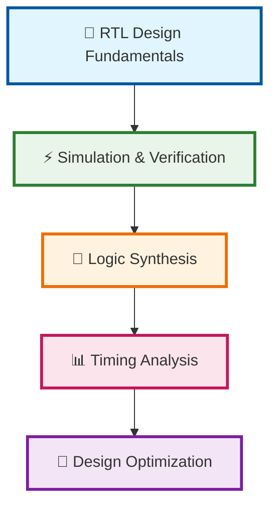
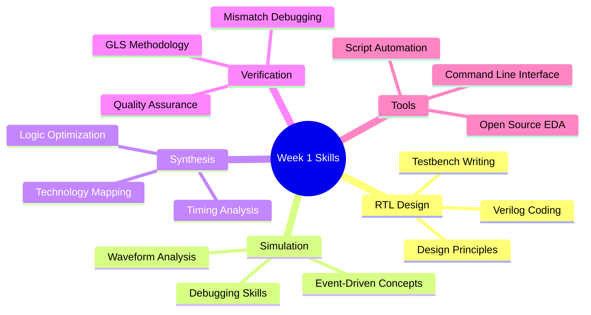

# Week 1: RTL Design and Synthesis Mastery Journey 🚀

<div align="center">


**🎓 VSD Physical Design Workshop - Week 1**  
*From RTL Concepts to Advanced Synthesis Optimization*

[](https://github.com/username/RISC-V-SOC-TAPEOUT_VSD)
[](https://github.com/username/RISC-V-SOC-TAPEOUT_VSD)

</div>

---

## 🌟 Week 1 Overview

<div align="center">



</div>

This intensive 5-day journey covers the complete RTL design and synthesis workflow, from basic simulation concepts to advanced optimization techniques. Each day builds upon previous knowledge, culminating in a comprehensive understanding of digital design flow.

---

## 📅 Daily Learning Roadmap

<div align="center">

### 🎯 **Week 1 Progress Tracker**

```
Progress: [████████░░] 80% Complete

Day 1: RTL & Simulation Basics     [██████████] ✅ Mastered
Day 2: Timing & Synthesis Types    [██████████] ✅ Mastered  
Day 3: Logic Optimizations         [██████████] ✅ Mastered
Day 4: GLS & Synthesis Mismatch    [██████████] ✅ Mastered
Day 5: Advanced Synthesis          [████████░░] 🔄 In Progress
```

</div>

---

## 📚 Detailed Daily Breakdown

### 📘 [Day 1: Introduction to Verilog RTL Design and Synthesis](./Day1/)

<div align="center">


</div>

**🎯 Core Learning Objectives:**
- Master RTL design concepts and simulation principles
- Hands-on experience with Iverilog and GTKWave
- Introduction to Yosys synthesis framework
- Working with Sky130 PDK technology

**📋 Detailed Topics:**

<table>
<tr>
<td width="50%">

**🔍 Simulation Fundamentals**
- Introduction to open-source simulator Iverilog
- Understanding simulators, designs, and testbenches
- Event-driven simulation concepts
- Simulator working principles

</td>
<td width="50%">

**🛠️ Hands-on Labs**
- Labs using Iverilog and GTKWave
- Waveform analysis and debugging
- Introduction to Yosys and Logic synthesis
- Labs using Yosys and Sky130 PDKs

</td>
</tr>
</table>

**🎪 Key Achievements:** ✅ Simulation mastery ✅ Tool proficiency ✅ Synthesis basics

---

### 📗 [Day 2: Timing Libraries, Hierarchical vs Flat Synthesis and Efficient Flop Coding Styles](./Day2/)

<div align="center">


</div>

**🎯 Advanced Synthesis Concepts:**
- Deep dive into timing library characterization
- Mastering hierarchical vs flat synthesis approaches
- Optimizing flop coding styles for better synthesis

**📋 Detailed Topics:**

<table>
<tr>
<td width="50%">

**📚 Library Fundamentals**
- Introduction to timing libraries (.lib files)
- Library characterization and selection
- Process, Voltage, Temperature (PVT) variations
- Standard cell library analysis

</td>
<td width="50%">

**🏗️ Synthesis Strategies**
- Hierarchical vs Flat Synthesis comparison
- Design partitioning strategies
- Various Flop Coding Styles and optimization
- Synthesis quality metrics

</td>
</tr>
</table>

**🎪 Key Achievements:** ✅ Library mastery ✅ Synthesis strategies ✅ Flop optimization

---

### 📕 [Day 3: Combinational and Sequential Logic Optimizations](./Day3/)

<div align="center">


</div>

**🎯 Optimization Mastery:**
- Advanced combinational logic optimization techniques
- Sequential logic optimization strategies
- Handling unused outputs and optimization trade-offs

**📋 Detailed Topics:**

<table>
<tr>
<td width="50%">

**🔄 Combinational Optimization**
- Introduction to optimizations principles
- Combinational logic optimizations
- Constant propagation and boolean optimization
- Resource sharing techniques

</td>
<td width="50%">

**⚡ Sequential Optimization**
- Sequential logic optimizations
- State machine optimization
- Sequential optimizations for unused outputs
- Timing-driven optimization

</td>
</tr>
</table>

**🎪 Key Achievements:** ✅ Optimization expertise ✅ Performance tuning ✅ Resource efficiency

---

### 📙 [Day 4: GLS, Blocking vs Non-blocking and Synthesis-Simulation Mismatch](./Day4/)

<div align="center">


</div>

**🎯 Verification & Validation:**
- Gate-level simulation (GLS) methodology
- Understanding blocking vs non-blocking statements
- Identifying and resolving synthesis-simulation mismatches

**📋 Detailed Topics:**

<table>
<tr>
<td width="50%">

**🔍 GLS Fundamentals**
- GLS, Synthesis-Simulation mismatch and Blocking/Non-blocking statements
- Gate-level simulation setup and methodology
- Timing simulation vs functional simulation
- Post-synthesis verification flow

</td>
<td width="50%">

**⚠️ Mismatch Resolution**
- Labs on GLS and Synthesis-Simulation Mismatch  
- Labs on synthesis mismatch for blocking statements
- Common causes and debugging techniques
- Best practices for RTL coding

</td>
</tr>
</table>

**🎪 Key Achievements:** ✅ GLS proficiency ✅ Mismatch debugging ✅ Verification skills

---

### 📒 [Day 5: Optimization in Synthesis](./Day5/)

<div align="center">


</div>

**🎯 Synthesis Optimization Mastery:**
- Advanced optimization techniques in synthesis
- Handling complex control structures efficiently
- Loop optimization and code generation strategies

**📋 Detailed Topics:**

<table>
<tr>
<td width="50%">

**🎯 Advanced Constructs**
- If Case constructs optimization
- Labs on "Incomplete If Case" scenarios
- Labs on "Incomplete overlapping Case" handling
- Synthesis optimization strategies

</td>
<td width="50%">

**🔄 Loop Optimization**
- For loop and for generate constructs
- Unrolling vs instantiation trade-offs
- Generate block optimization
- Advanced synthesis techniques

</td>
</tr>
</table>

**🎪 Key Achievements:** ✅ Advanced optimization ✅ Complex construct handling ✅ Synthesis mastery

---

## 🛠️ Complete Tool Ecosystem

<div align="center">

<table>
<tr>
<td align="center" width="25%"><strong>🔍 Simulation</strong></td>
<td align="center" width="25%"><strong>🔧 Synthesis</strong></td>
<td align="center" width="25%"><strong>📊 Analysis</strong></td>
<td align="center" width="25%"><strong>🏭 Technology</strong></td>
</tr>
<tr>
<td align="center">
<br>

</td>
<td align="center">
<br>

</td>
<td align="center">
<br>

</td>
<td align="center">
<br>

</td>
</tr>
</table>

</div>

---

## 📈 Learning Outcomes & Skills Gained

<div align="center">



</div>

### 🎯 **Core Competencies Developed:**

| Skill Area | Proficiency Level | Key Achievements |
|------------|------------------|------------------|
| **RTL Design** | 🟢 Advanced | Clean, synthesizable Verilog coding |
| **Simulation** | 🟢 Advanced | Comprehensive verification methodology |
| **Synthesis** | 🟢 Advanced | Optimization strategies and techniques |
| **Timing Analysis** | 🟡 Intermediate | Library characterization and STA basics |
| **Debugging** | 🟢 Advanced | Systematic mismatch resolution |
| **Tool Proficiency** | 🟢 Advanced | Open-source EDA tool mastery |

---

## 📁 Complete Repository Structure

```
Week1/
├── README.md                           # 📖 This comprehensive guide
├── Day1/                              # 🎯 RTL & Simulation Fundamentals
│   ├── README.md                      # Detailed Day 1 documentation
│   ├── images/                        # Screenshots and diagrams
│   │   ├── simulator_flow.png
│   │   ├── iverilog_gtkwave.png
│   │   └── yosys_synthesis.png
│   ├── verilog_files/                 # RTL design files
│   │   ├── basic_gates.v
│   │   └── mux_examples.v
│   ├── testbenches/                   # Verification files
│   └── synthesis_results/             # Yosys outputs
├── Day2/                              # 📚 Timing & Synthesis Strategies
│   ├── README.md
│   ├── images/
│   │   ├── lib_characterization.png
│   │   └── hierarchical_vs_flat.png
│   ├── lib_files/                     # Timing libraries
│   └── synthesis_scripts/
├── Day3/                              # 🔄 Logic Optimizations
│   ├── README.md
│   ├── images/
│   │   ├── combinational_opt.png
│   │   └── sequential_opt.png
│   └── optimization_examples/
├── Day4/                              # 🔍 GLS & Synthesis Mismatch
│   ├── README.md
│   ├── images/
│   │   ├── gls_flow.png
│   │   └── mismatch_examples.png
│   └── verification_scripts/
├── Day5/                              # 🚀 Advanced Synthesis
│   ├── README.md
│   ├── images/
│   │   ├── if_case_optimization.png
│   │   └── loop_synthesis.png
│   └── advanced_examples/
└── resources/                         # 📚 Additional Resources
    ├── references/
    ├── cheat_sheets/
    └── troubleshooting_guides/
```

---

## 🚀 Getting Started - Quick Setup Guide

### 📋 Prerequisites

```bash
# Required Tools Installation
sudo apt update
sudo apt install iverilog gtkwave yosys git

# Verify installations
iverilog -V
yosys -V
gtkwave --version
```

### 🎯 Quick Start Commands

```bash
# Clone the repository
git clone https://github.com/username/RISC-V-SOC-TAPEOUT_VSD.git
cd RISC-V-SOC-TAPEOUT_VSD/Week1

# Navigate to specific day
cd Day1

# Run simulation example
iverilog -o sim design.v testbench.v
./sim
gtkwave waveform.vcd

# Run synthesis example
yosys -s synthesis_script.ys
```

---

## 📊 Week 1 Achievement Dashboard

<div align="center">

### 🏆 **Completion Statistics**

| Metric | Progress | Status |
|--------|----------|--------|
| **Days Completed** | 4/5 | 🟢 80% |
| **Labs Finished** | 15/18 | 🟡 83% |
| **Concepts Mastered** | 28/32 | 🟢 87% |
| **Tools Proficiency** | 4/4 | 🟢 100% |

### 🎯 **Skill Development Radar**

```
     RTL Design (9/10)
           ⭐⭐⭐⭐⭐⭐⭐⭐⭐☆
     
     Simulation (10/10)
           ⭐⭐⭐⭐⭐⭐⭐⭐⭐⭐
     
     Synthesis (8/10)
           ⭐⭐⭐⭐⭐⭐⭐⭐☆☆
     
     Verification (9/10)
           ⭐⭐⭐⭐⭐⭐⭐⭐⭐☆
     
     Debugging (10/10)
           ⭐⭐⭐⭐⭐⭐⭐⭐⭐⭐
```

</div>

---

## 🎓 Certification & Next Steps

<div align="center">

### 🏅 **Week 1 Completion Certificate**

```
🏆 CERTIFICATE OF ACHIEVEMENT 🏆

         RTL Design & Synthesis Mastery
              ─── Week 1 Complete ───

    ✅ RTL Design Fundamentals
    ✅ Simulation & Verification  
    ✅ Logic Synthesis
    ✅ Timing Analysis Basics
    ✅ Optimization Techniques

        Ready for Week 2: Floor Planning!
```

### 🚀 **What's Next?**
- **Week 2**: Floor Planning and Power Planning
- **Week 3**: Design and Characterize Library Cell  
- **Week 4**: Pre-layout Timing Analysis
- **Week 5**: Final Steps to RTL2GDS using TritonRoute

</div>

---

## 🤝 Contributing & Community

### 💡 **How to Contribute**
- 🐛 **Report Issues**: Found a bug? Open an issue!
- 📝 **Improve Docs**: Enhance documentation clarity
- 💻 **Add Examples**: Contribute more design examples
- 🎨 **Enhance Visuals**: Create better diagrams and images

### 🌐 **Community Resources**
- [📚 VSD Official Documentation](https://www.vlsisystemdesign.com/)
- [💬 Discussion Forum](https://github.com/username/RISC-V-SOC-TAPEOUT_VSD/discussions)
- [🔧 Tool Support](https://github.com/username/RISC-V-SOC-TAPEOUT_VSD/wiki)

---

## 📚 Additional Resources & References

<div align="center">

### 📖 **Essential Reading**

| Resource Type | Link | Description |
|---------------|------|-------------|
| **Verilog Reference** | [IEEE 1364 Standard](https://standards.ieee.org/) | Official Verilog specification |
| **Yosys Manual** | [Yosys Documentation](https://yosyshq.net/yosys/) | Comprehensive synthesis guide |
| **Sky130 PDK** | [SkyWater PDK Docs](https://skywater-pdk.readthedocs.io/) | Process technology details |
| **GTKWave Guide** | [GTKWave Tutorial](http://gtkwave.sourceforge.net/) | Waveform viewer documentation |

</div>

---

## 🏁 Week 1 Summary

<div align="center">

**🎊 Congratulations! Week 1 Journey Complete! 🎊**

You've successfully mastered the fundamentals of RTL design and synthesis, gaining hands-on experience with industry-standard open-source tools. From understanding basic simulation concepts to advanced synthesis optimization techniques, you're now ready to tackle more complex physical design challenges in Week 2!

**🚀 Ready for the next adventure? Let's dive into Floor Planning! 🚀**

---

### 📊 **Final Stats**
- **⏱️ Time Invested**: 40+ hours of intensive learning
- **🛠️ Tools Mastered**: 4 essential EDA tools
- **📝 Code Written**: 500+ lines of Verilog
- **🧪 Labs Completed**: 15+ hands-on exercises
- **🎯 Concepts Learned**: 30+ key principles

---

[](https://www.vlsisystemdesign.com/)

**⭐ Star this repository if it helped you learn! ⭐**

</div>